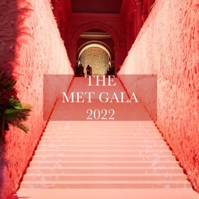
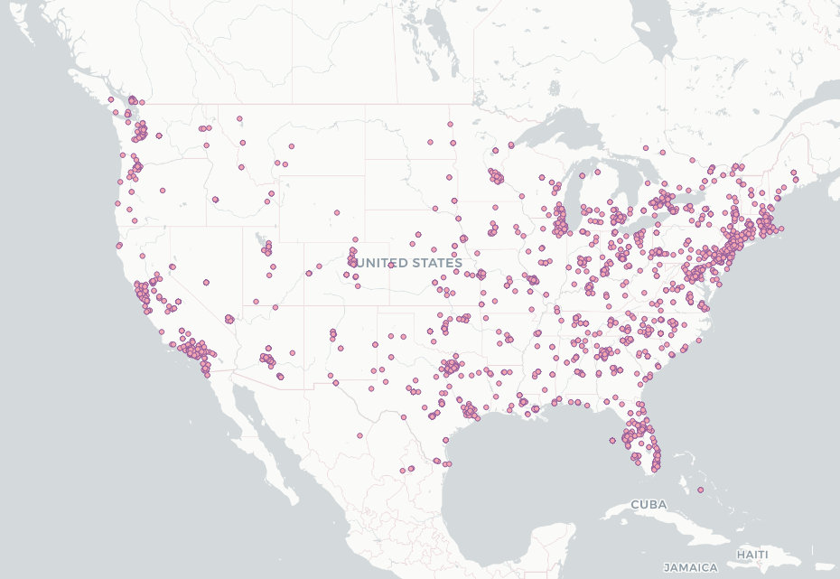
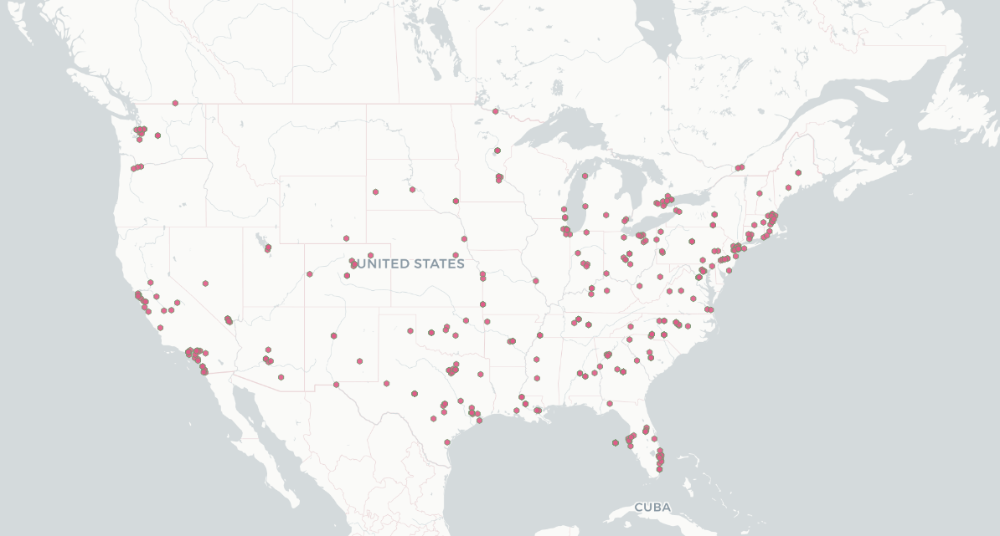
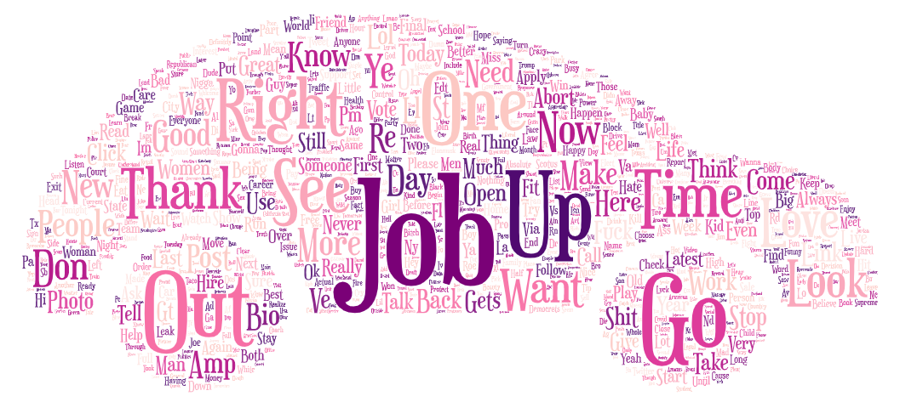
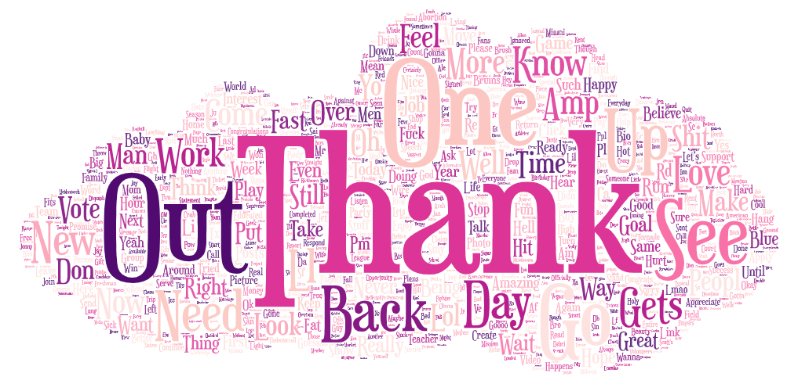

# **Met Gala Geotagged Tweets**

## **Introduction** 

**Met Gala** is one of the most famous and important events that happen in New York every year. 
It is a social gathering event where celebrities demonstrate different designers and present the gowns of a current year theme. This year's theme was **Gilded Glamour**.
This year's Met Gala was on May 2.

For this Lab, I chose to map the data that showed active tweets regarding Met Gala the day after the event. The event happened on May 2 and was widely covered in mass media and on different platforms. People usually discuss the theme of the year and closely follow celebrities' gown choices. 
After following the coverage on social media and different online platforms I wondered how excited people were two days after the event and whether it was still talked about.

### **Mapped Geotagged Tweets** 

The data for the presented maps was collected on May 3 and May 4. As you can see the event was much followed and tweeted about on May 3. Thats is when tv channels, online magazines, and different social media platforms began releasing photos of celebrities in their thematic gowns. People were comparing, liking or criticising, and taking an active participation in the event via Tweeter platform. 

As you can see most of the activity of tweets took place in Oregon, Washington, Florida, California, and in Eastern cost in Boston, Washington DC, and New York.

The second map shows data collected on May 4, which is two days after the event. As you can see people were still interested in the Met Gala but with less excitement and enthusiasm. And of course the activity continued in the states mentioned above. 

### **Word Clouds** 

The presented rendered word clouds were created with the help of the same geotagged tweets data. Presumably,those are the words often used in the tweets related to Met Gala. 
The first word cloud depicts the data from May 3 with mostly used word "Job". Next most popular words were "Rigth, Thank, Out, Go, One, Time, etc." 

The second word cloud shows the activity and most used words on May 4. Mostly used word of that day was "Thank". We can also see that some of the words from May 3 were still used in tweets on May 4. Among them "Out, One, Up, Back, See, Go, etc."

